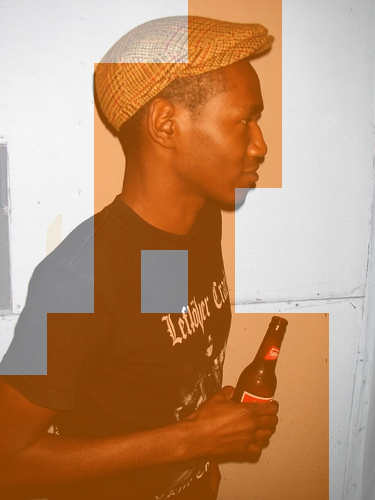
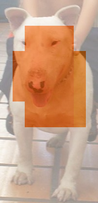

## TF\_Object\_Detection

Object Detection with SSD, retraining Inception.

Currently Have not implemented bounding box rectification

### RUNNING

```bash
python voc_process.py
./retrain.bash
```

### RESULTS








